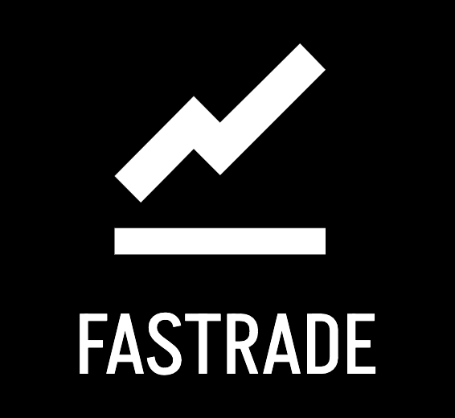
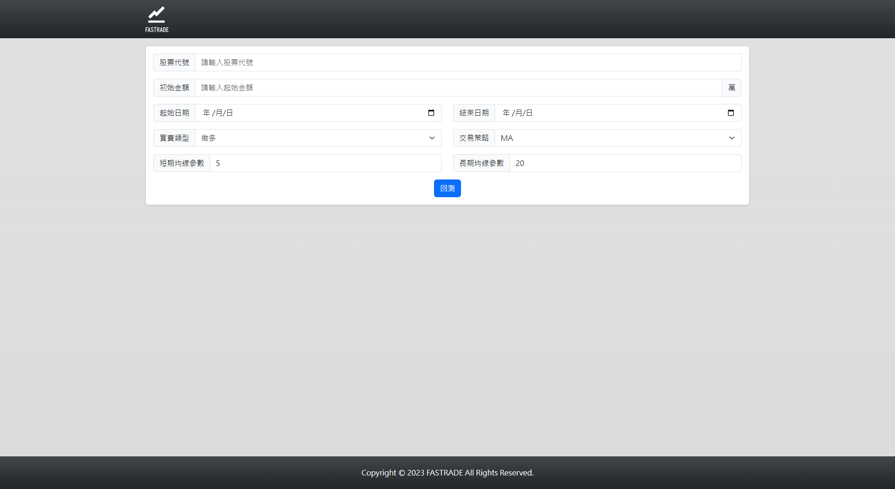
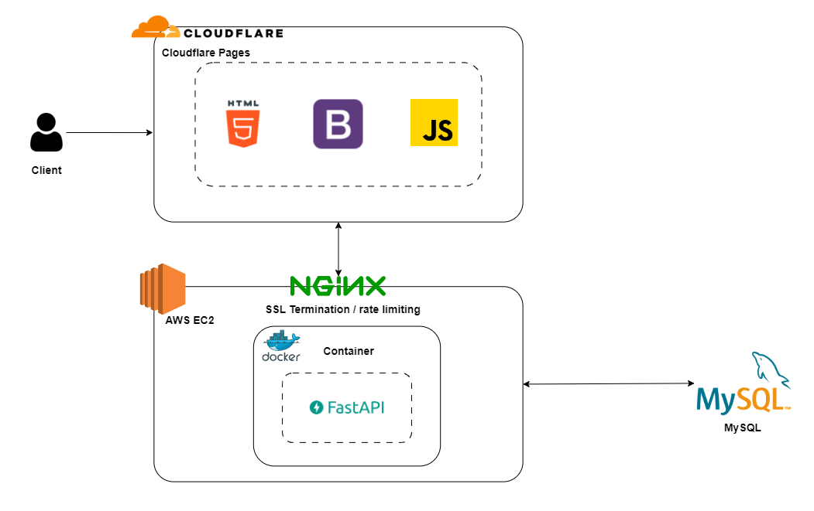
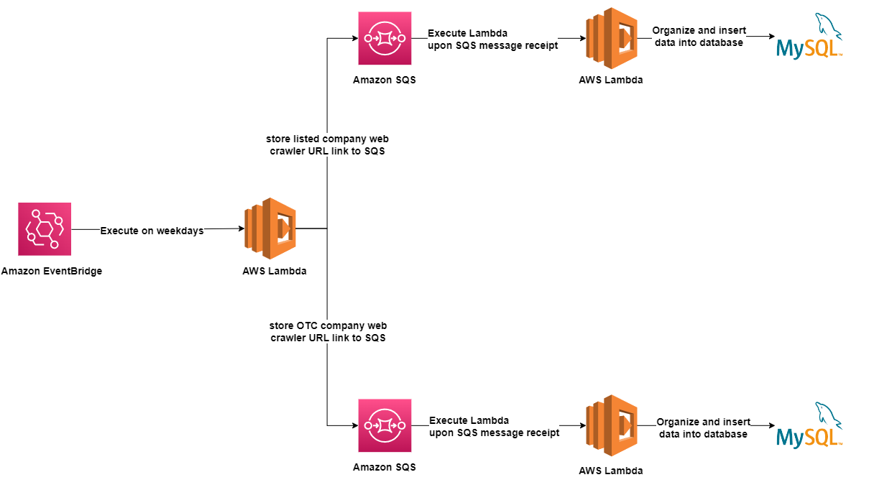
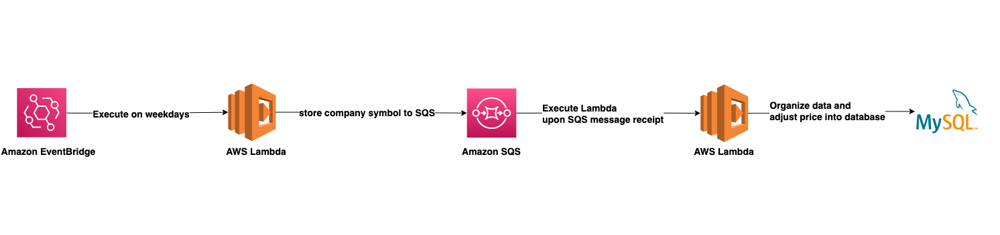
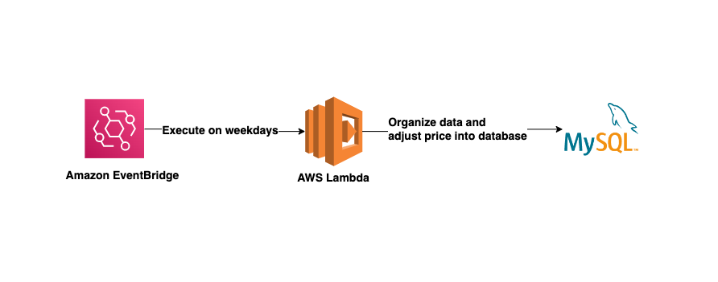
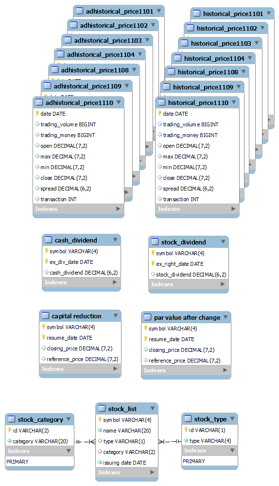

# [Fastrade](https://fastrade.store/)

  

Fastrade is a backtesting website that provides historical trading data for the Taiwan Stock Exchange and the Taipei Exchange since 2000. In addition, it offers three different trading strategies for users to choose from.

🔗Website URL: https://fastrade.store/

 

## :point_down:Table of Contents

- [Main Features](#point_downmain-features)
- [Backend Technique](#point_downbackend-technique)
  - [Infrastructure](#infrastructure)
  - [Environment](#environment)
  - [Database](#database)
  - [Cloud Services(AWS)](#cloud-servicesaws)
  - [Networking](#networking)
- [Architecture](#point_downarchitecture)
- [Data Pipeline](#point_downdata-pipeline)
- [Database Schema](#point_downdatabase-schema)
- [Frontend Technique](#point_downfrontend-technique)
  - [Cloudflare Pages](#Cloudflare-Pages)
  - [Bootstrap](#bootstrap)
- [API Doc](#point_downapi-doc)
- [Contact](#point_downcontact)

## :point_down:Main Features

- Free to choose long or short trading strategies that offer MA, KD, and MACD strategies.
- Provide backtesting data from 2000 to the latest date.
- Daily automatic update of stock market data with AWS Lambda.
- Store over six million pieces of stock market data in MySQL database and retrieve backtesting results within 3 seconds.

## :point_down:Backend Technique

### Infrastructure

- Docker

### Environment

- Python/FastAPI

### Database

- MySQL

### Cloud Services(AWS)

- EC2
- Lambda
- SQS
- EventBridge
- CloudWatch

### Networking

- HTTP & HTTPS
- Domain Name System (DNS)
- NGINX
- SSL (SSL for Free)

## :point_down:Architecture

## :point_down:Data Pipeline

- automated original price crawler
  

- automated stock dividend crawler that adjusts original prices to adjusted prices
  

- automated par value crawler that adjusts original prices to adjusted prices
  

- automated capital reduction crawler that adjusts original prices to adjusted prices
  

## :point_down:Database Schema

- each stock has an original stock price table and a adjusted stock price table
  

## :point_down:Frontend Technique

### Cloudflare Pages

- place a front-end website on Cloudflare Pages to achieve a front-end and back-end separation architecture

### Bootstrap

- create responsive web pages easily

## :point_down:API Doc

[API doc](https://api.fastrade.store/docs)

## :point_down:Contact

👨‍💻Wei-Han, Wang
 

:email:Email: s13602507586@gmail.com
